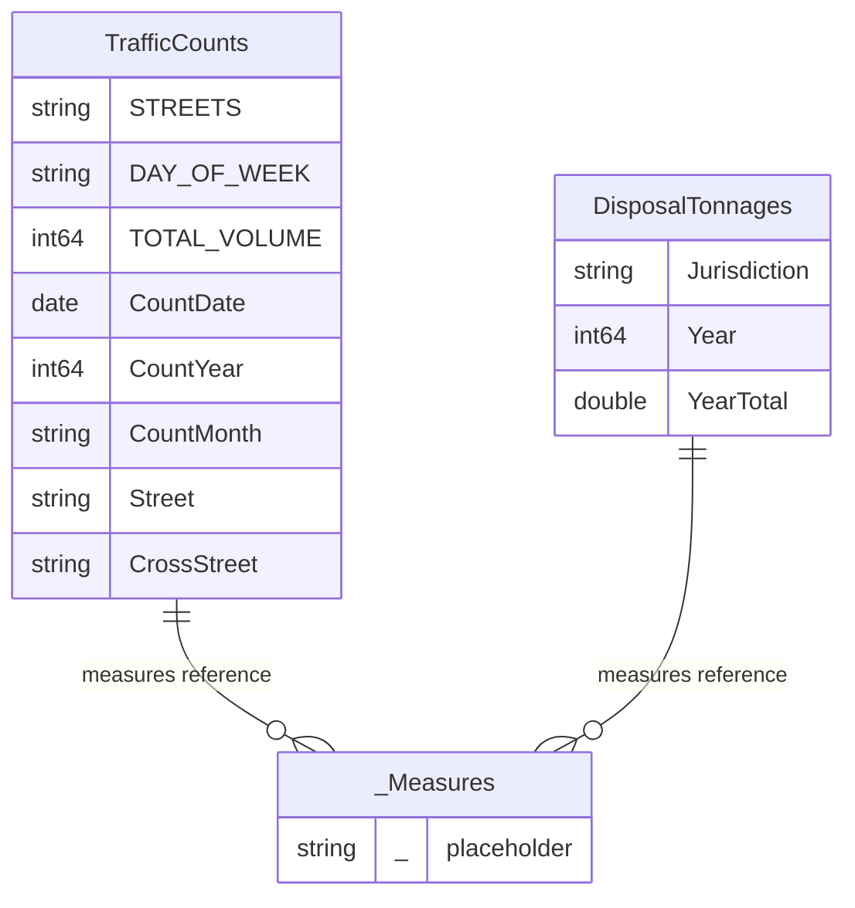

# LACountyPW Semantic Model Documentation

**Report:** LA County Public Works — Traffic & Disposal Analysis
**Last Updated:** 2026-04-08
**Compatibility Level:** 1600 | **Culture:** en-US

---

## Model Overview

This semantic model connects to LA County Public Works open data via ArcGIS REST APIs to analyze two operational domains: **traffic counts** at street intersections and **annual waste disposal tonnage** by jurisdiction. The model is optimized for a 2-page Power BI report targeting executive and operational audiences.

### Data Volume

| Table | Rows | Source |
|-------|------|--------|
| TrafficCounts | ~6,687 | ArcGIS MapServer Layer 59 |
| DisposalTonnages | ~572 | ArcGIS MapServer Layer 60 |
| _Measures | 1 (calculated) | Internal DAX table |

---

## Table Relationships

> **Note:** TrafficCounts and DisposalTonnages are independent fact tables with no direct relationship between them. The `_Measures` table serves as a centralized container for all DAX calculations that reference both tables. A system-generated `LocalDateTable` is auto-linked to `TrafficCounts[CountDate]` for date intelligence.

---

## User Hierarchies

| Table | Hierarchy | Levels | Purpose |
|-------|-----------|--------|---------|
| TrafficCounts | Time Drill | CountYear > CountMonth | Drill from year to month for seasonal traffic trends |
| TrafficCounts | Location Drill | Street > CrossStreet | Drill from main street to specific intersection |
| DisposalTonnages | Jurisdiction by Year | Jurisdiction > Year | Drill from city to annual tonnage detail |

---

## Data Dictionary

### TrafficCounts

Traffic count observations from LA County street intersections. Each row represents one traffic count taken at a specific location on a specific day.

| Column | Data Type | Description |
|--------|-----------|-------------|
| **STREETS** | Text | Original raw intersection string from the API (e.g., "MAIN ST S/O 1ST AVE"). Contains both streets joined by a directional delimiter. Retained for unique location counting. |
| **DAY_OF_WEEK** | Text | Day of the week the count was recorded (e.g., Mon, Tue, Wed). 7 unique values. |
| **TOTAL_VOLUME** | Whole Number | Daily vehicle count at this location. Range: 0 to 49,085. Primary fact column for all traffic measures. |
| **CountDate** | Date | Date of the traffic count. Converted from Unix epoch milliseconds during data load. Linked to auto-generated date table. |
| **CountYear** | Whole Number | Year extracted from CountDate (e.g., 2021-2026). Used as the primary time axis. Summarize disabled to prevent accidental summing. |
| **CountMonth** | Text | Month name from CountDate (e.g., January, February). 12 unique values for seasonal analysis. |
| **Street** | Text | Primary street name parsed from STREETS by splitting on directional delimiters (S/O, N/O, E/O, W/O). 1,091 unique values. |
| **CrossStreet** | Text | Cross street name parsed from STREETS after the delimiter. Null when no delimiter found. 1,596 unique values. |

### DisposalTonnages

Annual waste disposal tonnage reported by each jurisdiction (city or unincorporated area) in LA County.

| Column | Data Type | Description |
|--------|-----------|-------------|
| **Jurisdiction** | Text | City or unincorporated area name (e.g., LOS ANGELES, PASADENA, GLENDALE). 89 distinct jurisdictions. |
| **Year** | Whole Number | Calendar year of the record (2020-2026). Summarize disabled to prevent accidental summing. |
| **YearTotal** | Decimal Number | Total waste tonnage for this jurisdiction in this year, in tons. Primary fact column for all disposal measures. |

---

## Measure Definitions

All measures are stored in the `_Measures` table and organized into display folders.

### Traffic Measures

| Measure | DAX | Business Logic |
|---------|-----|----------------|
| **Total Counts** | `COUNTROWS(TrafficCounts)` | Total number of traffic count records. Each record is one observation at one location on one day. Use this to understand data coverage. |
| **Avg Daily Volume** | `AVERAGE(TrafficCounts[TOTAL_VOLUME])` | Average daily vehicle count across all locations and dates in the current view. Answers: "What's the typical daily traffic?" |
| **Max Daily Volume** | `MAX(TrafficCounts[TOTAL_VOLUME])` | Highest single-day vehicle count ever recorded at any location. Identifies peak traffic events. |
| **Total Volume** | `SUM(TrafficCounts[TOTAL_VOLUME])` | Cumulative vehicle count across all records. Total traffic volume in the selected filters. |
| **Distinct Locations** | `DISTINCTCOUNT(TrafficCounts[STREETS])` | Number of unique monitoring locations (street intersections). Shows geographic breadth of the data. |

### Disposal Measures

| Measure | DAX | Business Logic |
|---------|-----|----------------|
| **Total Tonnage** | `SUM(DisposalTonnages[YearTotal])` | Total waste disposal tonnage across all jurisdictions and years in the current view. |
| **Avg Tonnage** | `AVERAGE(DisposalTonnages[YearTotal])` | Average annual tonnage per jurisdiction. Since each row is one city-year, this averages across those entries. |
| **Jurisdiction Count** | `DISTINCTCOUNT(DisposalTonnages[Jurisdiction])` | Number of distinct cities/areas reporting data. Shows coverage breadth. |
| **Top 10 Tonnage** | `IF(RANKX(ALL(...), [Total Tonnage], , DESC, Dense) <= 10, [Total Tonnage])` | Returns Total Tonnage only for the top 10 jurisdictions by volume. Uses RANKX with ALL to rank globally regardless of slicer selections. Jurisdictions outside the top 10 return BLANK, so bar charts naturally display only 10 bars. |

### Year-over-Year Measures

| Measure | DAX | Business Logic |
|---------|-----|----------------|
| **Vol YoY %** | `VAR CY = [Avg Daily Volume]` `VAR CurrentYear = MAX(CountYear)` `VAR PY = CALCULATE([Avg Daily Volume], FILTER(ALL(TrafficCounts), CountYear = CurrentYear - 1))` `RETURN IF(HASONEVALUE(CountYear) && PY, DIVIDE(CY - PY, PY))` | Year-over-year change in average daily traffic. Compares the selected year's average to the prior year. The HASONEVALUE guard returns BLANK at the grand total level to prevent misleading calculations. FILTER+ALL breaks out of slicer context to fetch the prior year's value. |
| **Tonnage YoY %** | `VAR CY = [Total Tonnage]` `VAR CurrentYear = MAX(Year)` `VAR PY = CALCULATE([Total Tonnage], FILTER(ALL(DisposalTonnages), Year = CurrentYear - 1))` `RETURN IF(HASONEVALUE(Year) && PY, DIVIDE(CY - PY, PY))` | Year-over-year change in total disposal tonnage. Same pattern as Vol YoY %. Only evaluates when a single year is in context. Positive = tonnage increased, negative = decreased. |

---

## Data Sources

### Traffic Counts (ArcGIS REST API)

| Property | Value |
|----------|-------|
| **Endpoint** | `https://dpw.gis.lacounty.gov/dpw/rest/services/PW_Open_Data/MapServer/59/query` |
| **Protocol** | ArcGIS REST API with JSON response |
| **Authentication** | Anonymous (public data) |
| **Pagination** | 1,000 records per call, 7 paginated calls using `resultOffset` parameter (offsets 0-6000) |
| **Refresh Mode** | Import |

**Power Query Transformation Steps:**
1. **Paginated fetch** — 7 API calls with offsets 0, 1000, 2000... 6000, combined into a single table
2. **Type casting** — STREETS and DAY_OF_WEEK to text; COUNT_DATE and TOTAL_VOLUME to integer
3. **Date conversion** — COUNT_DATE (Unix epoch ms) converted to proper date via `#datetime(1970,1,1,0,0,0) + #duration(0,0,0, epoch/1000)`
4. **Year/Month extraction** — CountYear via `Date.Year()`, CountMonth via `Date.MonthName()`
5. **Street parsing** — STREETS split on directional delimiters (S/O, N/O, E/O, W/O) into Street and CrossStreet columns
6. **Cleanup** — COUNT_DATE and ESRI_OID columns removed

### Disposal Tonnages (ArcGIS REST API)

| Property | Value |
|----------|-------|
| **Endpoint** | `https://dpw.gis.lacounty.gov/dpw/rest/services/PW_Open_Data/MapServer/60/query` |
| **Protocol** | ArcGIS REST API with JSON response |
| **Authentication** | Anonymous (public data) |
| **Pagination** | None required (572 records, under 1,000 limit) |
| **Refresh Mode** | Import |

**Power Query Transformation Steps:**
1. **Single fetch** — One API call retrieves all records
2. **Type casting** — JURISDICTION to text; YEAR to integer; YRTOTAL to number
3. **Column rename** — JURISDICTION > Jurisdiction, YEAR > Year, YRTOTAL > YearTotal
4. **Cleanup** — ESRI_OID column removed

---

## Data Quality Notes

- **2026 data is incomplete** — only 6 traffic records and 38 jurisdictions with partial tonnage. Line charts exclude 2026 via visual-level filters.
- **YoY measures return BLANK at grand total** — by design. The HASONEVALUE guard prevents misleading comparisons when multiple years are aggregated together.
- **Traffic data starts at 2021** — no records before this year in the API.
- **Disposal data covers 2020-2026** — 89 jurisdictions consistently report across all complete years.
- **STREETS field has no standardized format** — directional delimiters (S/O, N/O, E/O, W/O) are used to parse intersections, but some entries may not follow this pattern and will retain the full string in the Street column with a null CrossStreet.

---

## Report Pages

| Page | Title | Key Visuals |
|------|-------|-------------|
| 1 | Traffic Count Overview | 2 slicers (Year, Street), 4 KPI cards, line chart (Avg Volume by Year), bar chart (Volume by Day of Week), detail table |
| 2 | Disposal Tonnage Analysis | 2 slicers (Year, Jurisdiction), 4 KPI cards, line chart (Tonnage by Year), bar chart (Top 10 Jurisdictions), detail table |

---

*PBI Build & Deploy Framework — Phase 6: Documentation*
